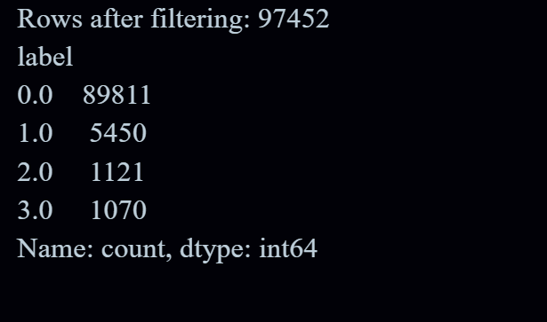

# Consumer Complaint Text Classification

## **Project Overview**
This project focuses on **classifying consumer complaints** into four categories using text data from the [Consumer Complaint Database](https://catalog.data.gov/dataset/consumer-complaint-database):

| Label | Category |
|-------|----------|
| 0     | Credit reporting, repair, or other |
| 1     | Debt collection |
| 2     | Consumer Loan |
| 3     | Mortgage |

The goal is to develop an **end-to-end text classification pipeline** using **TF-IDF features**, **classical machine learning models**, and a **feedforward neural network (FFNN)**.

---

## **1. Dataset Description**
- **Source:** Consumer Complaint Database (U.S. Consumer Financial Protection Bureau)  
- **Columns Used:** `Product`, `Issue`, `Consumer complaint narrative`, `Company`, `State`  
- **Data Cleaning:**  
  - Missing complaints replaced by `Issue` text  
  - Filtered rows with empty text or undefined category  
- **Balanced Dataset:**  
  - Original dataset was imbalanced, dominated by "Credit reporting"  
  - Applied **downsampling** to better balance minority classes  

**Class Distribution Visualization:**  

---

## **2. Exploratory Data Analysis (EDA)**
**Text Statistics:**  
- Average complaint length: 20–50 words  
- Histogram of word counts:  
  

**Frequent Words Analysis:**  
- Most common words visualized using a **wordcloud**:  

**Insights:**  
- Frequent terms include “incorrect information”, “account”, “payment”, “credit report”  
- Text is noisy; preprocessing is crucial  

---

## **3. Text Pre-processing**
Steps performed on complaint text:

1. **Lowercasing** all text  
2. **Removing punctuation, numbers, and special characters**  
3. **Tokenization** into words  
4. **Stopword removal** using NLTK stopword list  
5. **Lemmatization** to reduce words to base form  
6. **Removing short words (<2 letters)**  

> These steps help reduce noise and improve model performance.

---

## **4. Feature Representation**
- **TF-IDF Vectorization:**  
  - Max features: 5000  
  - Unigrams and bigrams included  
- **Feature Selection:**  
  - `SelectKBest` with chi-square (`k=1000`)  
- **Result:** Dense feature matrix suitable for classical ML models and FFNN

---

## **5. Model Selection**
### **Classical Machine Learning Models**
1. Logistic Regression (One-vs-Rest)  
2. Multinomial Naive Bayes  
3. Linear Support Vector Classifier  

### **Deep Learning Model**
- **Feedforward Neural Network (FFNN)**  
  - Input layer: 5000 TF-IDF features  
  - Hidden layer: 128 neurons with ReLU activation  
  - Output layer: 4 neurons (softmax)  

---

## **6. Model Evaluation**
**Evaluation Metrics (Weighted Average):**  

| Model                 | Accuracy  | Precision | Recall   | F1-score |
|-----------------------|-----------|-----------|---------|----------|
| Logistic Regression   | 0.9710    | 0.9709    | 0.9710  | 0.9702   |
| Multinomial NB        | 0.9566    | 0.9570    | 0.9566  | 0.9567   |
| Linear SVM            | 0.9712    | 0.9710    | 0.9712  | 0.9705   |
| FFNN                  | 0.9725    | 0.9723    | 0.9725  | 0.9720   |

**Performance Comparison:**  

**Confusion Matrices:**  
- Logistic Regression  
  
- Multinomial NB  
  
- Linear SVM  
  
- FFNN  

**Insights:**
- FFNN achieves the **highest accuracy and F1-score (~97.25%)**  
- Linear SVM and Logistic Regression show very similar performance (~97.1%)  
- Multinomial NB performs slightly lower (~95.7%), but still reliable  
- Misclassifications mainly occur between overlapping classes like “Credit reporting” and “Consumer Loan”  

---

## **7. Key Takeaways**
- TF-IDF with feature selection provides strong features for multi-class classification  
- FFNN slightly outperforms classical ML models  
- Proper EDA and preprocessing are essential to handle noisy, user-generated text  
- Workflow is modular and can be extended to transformer-based models in the future  

---

## **8. Future Work**
- Fine-tune **transformer models** (DistilBERT, RoBERTa) for contextual embeddings  
- Incorporate **NER** to extract entities such as companies, dates, and amounts  
- Add **sentiment analysis** or **topic modeling** for richer features  
- Deploy as a **real-time web classifier** for consumer complaints  

---

## **9. References**
1. [Consumer Complaint Database – CFPB](https://catalog.data.gov/dataset/consumer-complaint-database)  
2. [Scikit-learn TF-IDF & ML documentation](https://scikit-learn.org/stable/modules/feature_extraction.html)  
3. [PyTorch Neural Network Tutorial](https://pytorch.org/tutorials/beginner/blitz/neural_networks_tutorial.html)  

---

